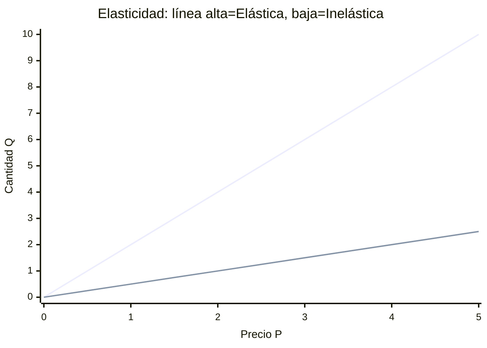

# TIPOS DE ELASTICIDAD PRECIO DEMANDA

| TIPO                     | VALOR        | RESPUESTA    |
| ------------------------ | ------------ | ------------ |
| Perfectamente Inelastica | \|E\| = 0    | Nula         |
| Inelástica               | 0<\|E\|<1    | Débil        |
| Unitaria                 | \|E\| =1     | Proporcional |
| Elástica                 | \|E\|>1      | Fuerte       |
| Perfectamente elástica   | \|E\| --> ♾️ | Infinita     |
## FÓRMULA ELASTICIDAD PRECIO DEMANDA
$$E_p^D = \frac{\% \Delta Q_D}{\% \Delta P} = \frac{\Delta Q_D}{\Delta P} \cdot \frac{P}{Q_D}$$
	Esta siempre va a ser negativa por su naturaleza. Se trabaja con el valor absoluto

# FÓRMULA ELASTICIDAD PRECIO OFERTA
$$E_p^O = \frac{\% \Delta Q_O}{\% \Delta P} = \frac{\Delta Q_O}{\Delta P} \cdot \frac{P}{Q_O}$$

| VALOR | TIPO       |
| ----- | ---------- |
| E<1   | Inelástica |
| E=0   | Unitaria   |
| E>1   | Elástica   |

# ELASTICIDAD INGRESO DEMANDA
$$E_Y = \frac{\% \Delta Q_D}{\% \Delta Y}$$

| TIPO DE BIEN          | VALOR  |
| --------------------- | ------ |
| Normal Superior(lujo) | E>1    |
| Normal Necesario      | 0<E<=1 |
| Inferior              | E<0    |

# ELASTICIDAD CRUZADA

$$E_{XY} = \frac{\% \Delta Q_{D_X}}{\% \Delta P_Y}$$
> ES PARA SABER LA RELACION ENTRE 2 BIENES
> 	Exy > 0 --> SUSTITUTOS
> 	Exy < 0 --> COMPLEMENTARIOS
> 	Exy = 0 --> INDEPENDIENTES

<canvas id="elasticidad"></canvas>

