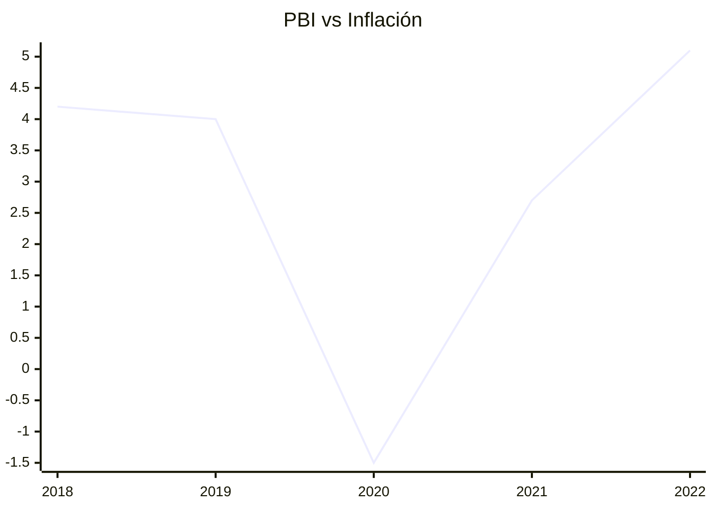

TEST
```chartsview
#-----------------#
#- chart type    -#
#-----------------#
type: Area

#-----------------#
#- chart data    -#
#-----------------#
data:
  - label: "1951"
    value: 38
  - label: "1952"
    value: 52
  - label: "1956"
    value: 61
  - label: "1957"
    value: 145
  - label: "1958"
    value: 48

#-----------------#
#- chart options -#
#-----------------#
options:
  xField: label
  yField: value
```
> TEST



